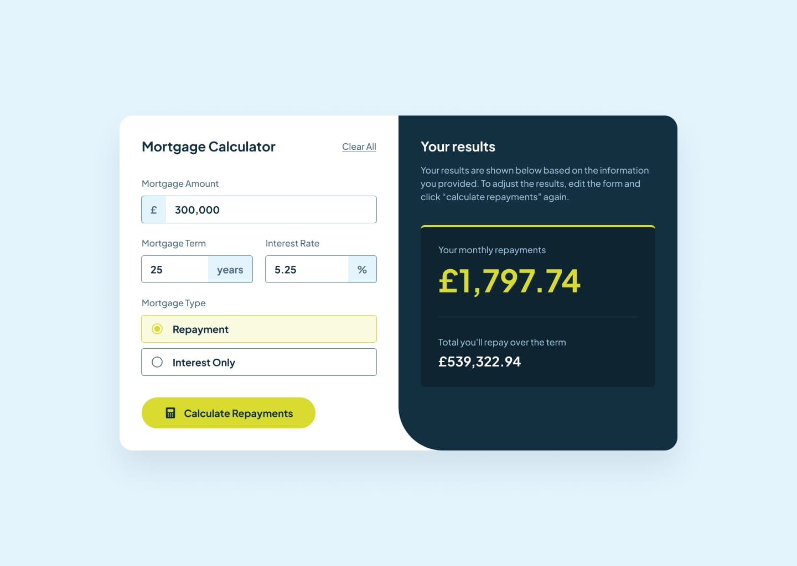

# Frontend Mentor - Mortgage repayment calculator solution

This is a solution to the [Mortgage repayment calculator challenge on Frontend Mentor](https://www.frontendmentor.io/challenges/mortgage-repayment-calculator-Galx1LXK73). Frontend Mentor challenges help you improve your coding skills by building realistic projects.

## Table of contents

- [Frontend Mentor - Mortgage repayment calculator solution](#frontend-mentor---mortgage-repayment-calculator-solution)
  - [Table of contents](#table-of-contents)
  - [Overview](#overview)
    - [The challenge](#the-challenge)
    - [Screenshot 🔳](#screenshot-)
    - [Links 🔗](#links-)
  - [My process 🛠](#my-process-)
    - [Built with](#built-with)
  - [Author 🤵](#author-)
  - [Reminder 📝](#reminder-)

## Overview

### The challenge

Users should be able to:

- Input mortgage information and see monthly repayment and total repayment amounts after submitting the form
- See form validation messages if any field is incomplete
- Complete the form only using their keyboard
- View the optimal layout for the interface depending on their device's screen size
- See hover and focus states for all interactive elements on the page

### Screenshot 🔳

### Links 🔗

- Solution URL: [https://github.com/JohnMwendwa/mortgage-repayment-calculator](https://github.com/JohnMwendwa/mortgage-repayment-calculator)
- Live Site URL: [https://johnmwendwa.github.io/mortgage-repayment-calculator](https://johnmwendwa.github.io/mortgage-repayment-calculator/)

## My process 🛠

### Built with

- Semantic HTML5 markup
- CSS custom properties
- CSS flexbox
- CSS Grid
- Mobile-first workflow
- JavaScript

## Author 🤵

- Website - [John Mwendwa](https://johnmwendwa.vercel.app/)
- Frontend Mentor - [@JohnMwendwa](https://www.frontendmentor.io/profile/JohnMwendwa)

## Reminder 📝

"Don't stop until you're proud"
